# REPORT: Competitor Analysis - Insights from Parch and Posey
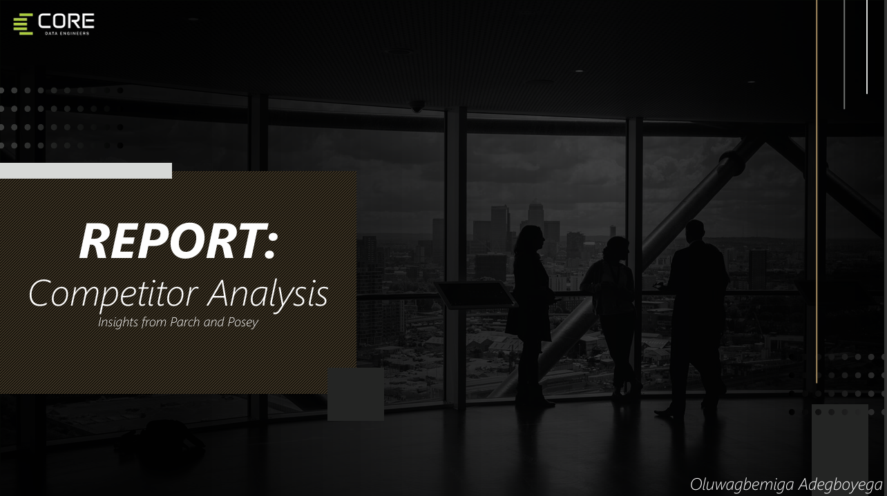

## Navigation / Quick Access
Quickly move to section you are interested in by clicking on appropriate link:
- [Overview](https://github.com/Abdelrahman7000/cde_group_assignment/tree/oluwagbemiga-adegboyega#overview)
- [Project Objective](https://github.com/Abdelrahman7000/cde_group_assignment/tree/oluwagbemiga-adegboyega#objectives)
- [Data Model](https://github.com/Abdelrahman7000/cde_group_assignment/tree/oluwagbemiga-adegboyega#data-model)
- [Exploratory Data Analysis (EDA) ](https://github.com/Abdelrahman7000/cde_group_assignment/tree/oluwagbemiga-adegboyega#exploratory-data-analysis-(eda))
- [Tech Stack](https://github.com/Abdelrahman7000/cde_group_assignment/tree/oluwagbemiga-adegboyega#tech-stack)
- [Analysis Workflow](https://github.com/Abdelrahman7000/cde_group_assignment/tree/oluwagbemiga-adegboyega#analysis-workflow)
- [Key Insights](https://github.com/Abdelrahman7000/cde_group_assignment/tree/oluwagbemiga-adegboyega#key-insights)
- [Recommendations](https://github.com/Abdelrahman7000/cde_group_assignment/tree/oluwagbemiga-adegboyega#recommendations)
- [Conclusion](https://github.com/Abdelrahman7000/cde_group_assignment/tree/oluwagbemiga-adegboyega#conclusion)

## Overview

This project digs deep into the analysis of CoreDataEngineer's Competitor,**Parch & Posey**, as they look to diversify into sales of goods and services. To be able to make informed business decisions and develop a competitive strategy, this project conducted by **Oluwagbemiga Adegboyega** helps with a comprehensive exploratory data analysis of its competitor by looking into **Revenue trends**, **Sales/Orders trends**, **customer behavior**, **regional performance**, and **Channel Patterns**. At the end, the provided insights will help **CoreDataEngineers** to understand the market better and identify areas of improvement.

The analysis was performed using SQL queries on the Parch & Posey database, and the results were visualized using powerbi before coming up with a succinct powerpoint presentation.

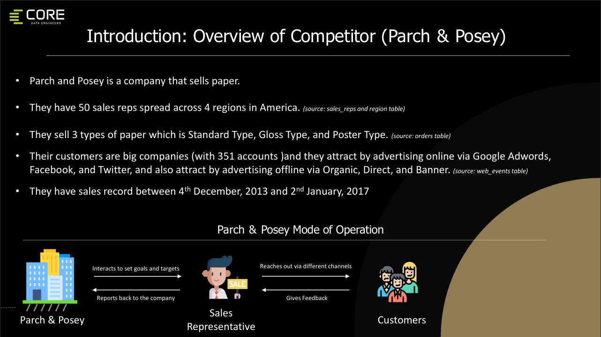

## Objectives

The main objectives of this analysis:
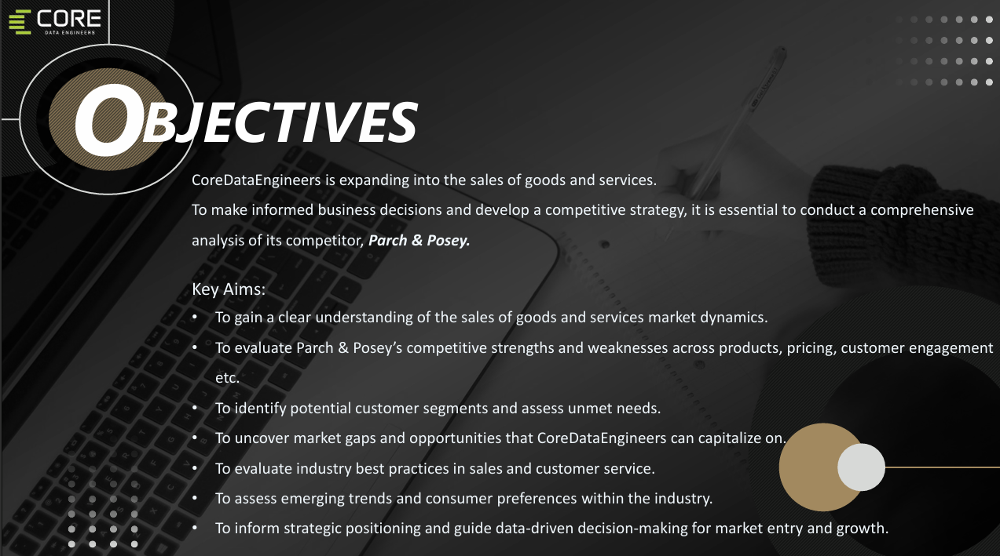

<em>Project Objectives</em>

## Data Model 
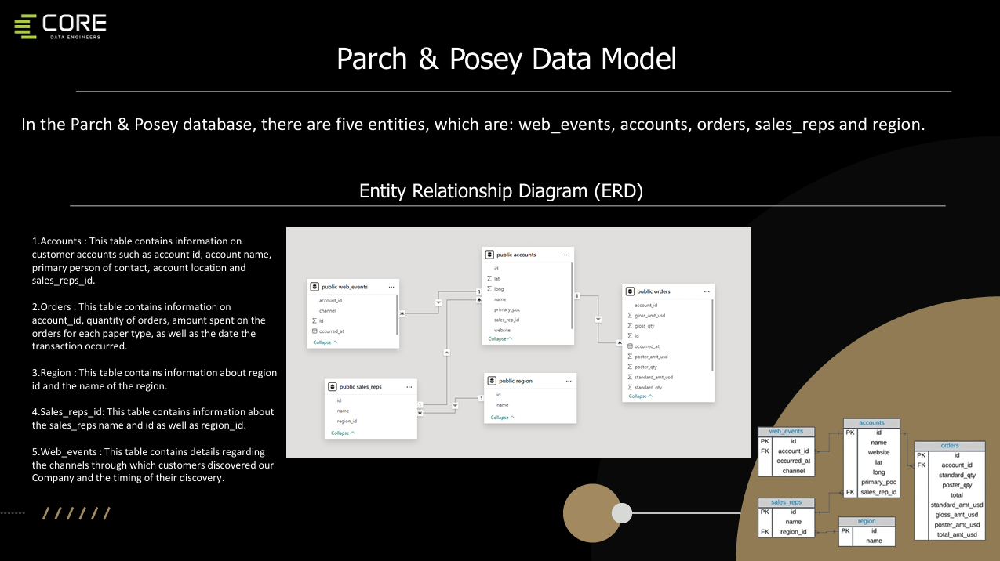

## Exploratory Data Analysis (EDA) 

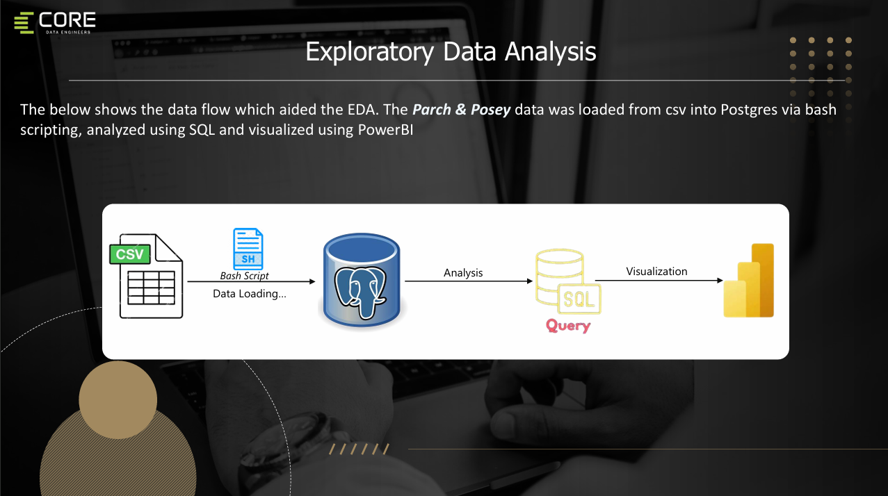

## Tech Stack
- **PostgreSQL**: To load and query the Parch & Posey database.
- **Bash Scripts**: For automating the data loading process into the PostgreSQL database.
- **SQL**: For exploratory data analysis and answering key business questions.
- **PowerBI**: For visualization of insights.

## Analysis Workflow

1. **Data Loading**: Data was loaded into PostgreSQL using **Bash scripts**.
2. **Exploratory Data Analysis**: SQL queries were used to analyze different aspects of the data, including sales, customer accounts, channels, and regional performance.
3. **Visualization**: Key insights were visualized using charts and figures to highlight trends and patterns.

## Key Insights

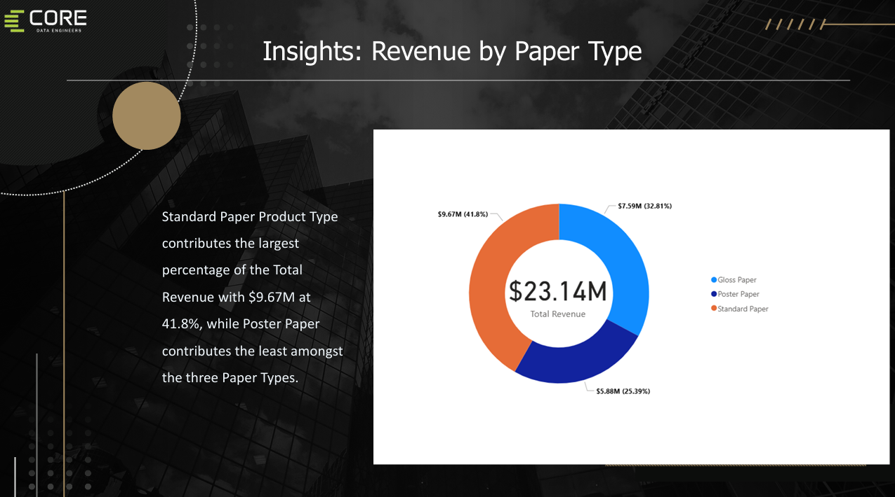

<em>Revenue by Paper Type</em>

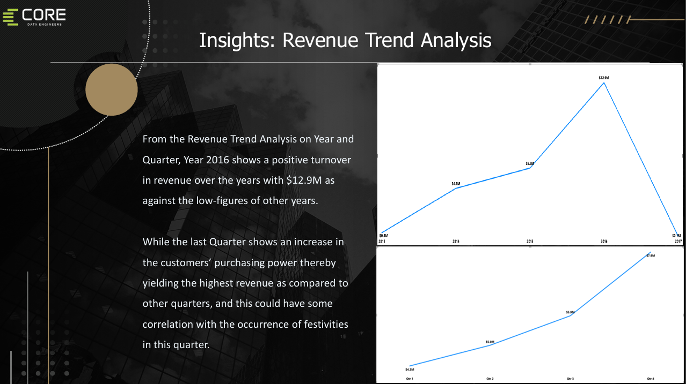

<em>Revenue Trend Analysis (Year and Quarter)</em>

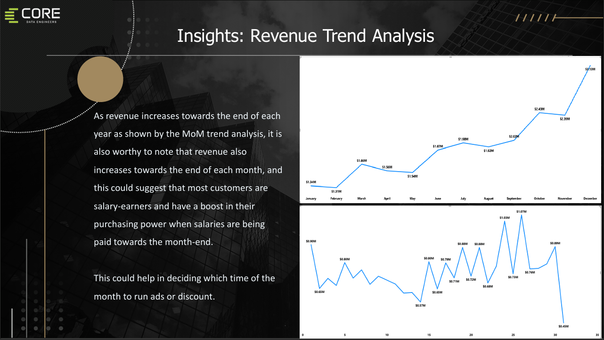

<em>Revenue Trend Analysis (Month and Day)</em>

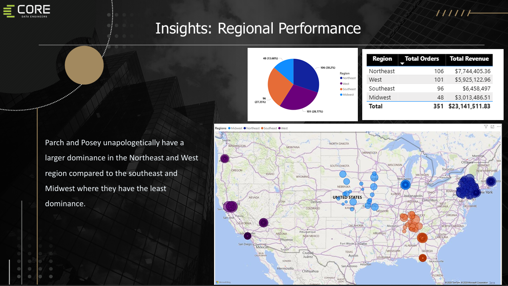

<em>Regional Performance</em>

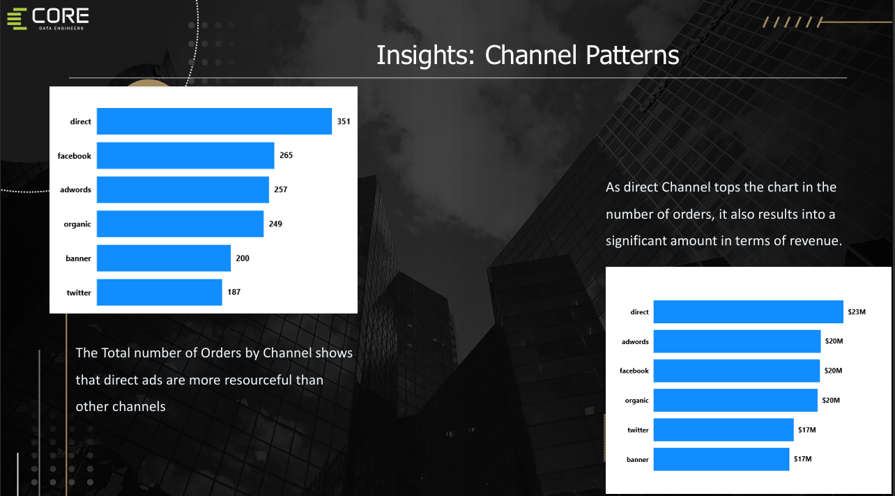

<em>Channel Pattern</em>

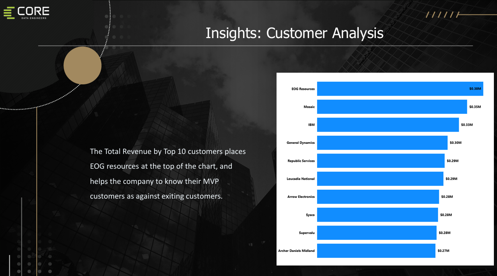

<em>Customer Analysis</em>

These insights have been compiled into a PowerPoint presentation, which can be accessed [here](https://docs.google.com/presentation/d/e/2PACX-1vS42rlBNATGciEdUwSSWs-XxQPOt1y9AZMkBvAOjQpOEldhEDj57Fv8GSgtrC92SulNVn1Ly3-8wUF1/pub?start=false&loop=false&delayms=3000).

## Recommendations

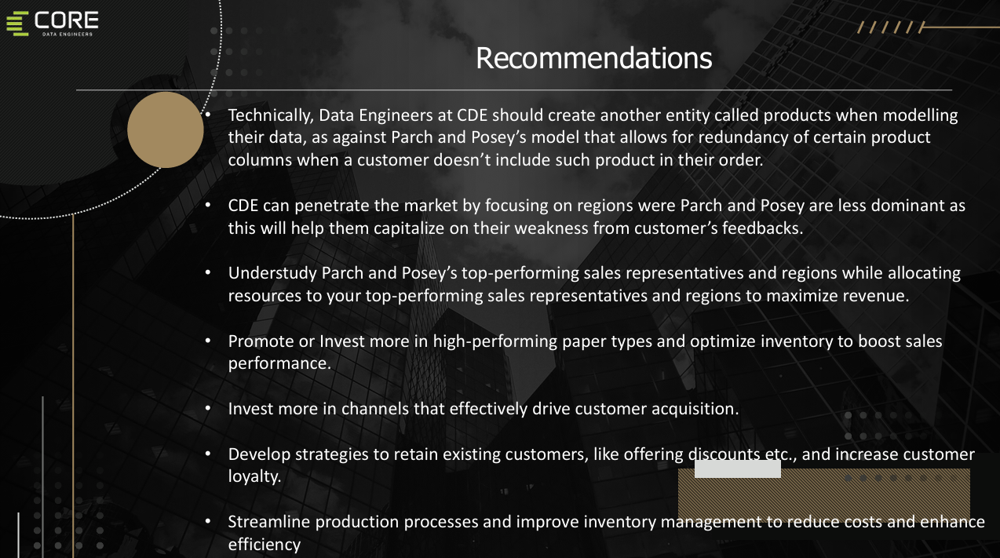

<em>Key Recommendations</em>

## Conclusion

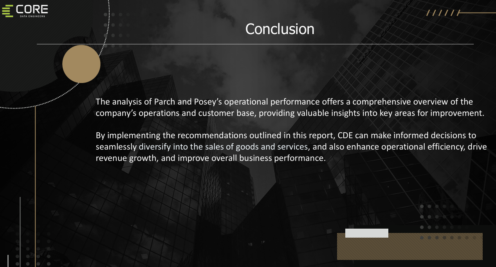

<em>Conclusion</em>

  
The analysis conducted by **Oluwagbemiga Adegboyega** serves as a foundation for strategic decision-making at **CoreDataEngineers**.

---
